# Facility ARG Site

Facility ARG Site is an interactive web application built with Next.js and TypeScript, designed for Alternate Reality
Game (ARG) experiences. It features custom UI components, audio effects, and dynamic user state management, creating a
unique, immersive environment.

> This is an indie psychological horror ARG experience. It is not affiliated with any existing IPs.


## Features

- **Boot Sequence & Disclaimer**: Simulates a system boot and requires user disclaimer acceptance before entering the
  site.
- **Dynamic Routing**: Redirects users based on cookies and state, unlocking new areas and experiences.
- **Custom UI Components**: Includes friendly/sarcastic hint system (TAS), dialogs, buttons, and more, powered by Radix
  UI and custom logic.
- **Audio Integration**: Background music and sound effects managed via custom hooks.
- **Multiple Themed Pages**: Explore areas like Smileking, Dream, Terminal, Wifi Login, and more.
- **Server & Client State**: Uses cookies for persistent user state and progression.

## Technologies Used

- [Next.js](https://nextjs.org/) (App Router)
- [TypeScript](https://www.typescriptlang.org/)
- [Tailwind CSS](https://tailwindcss.com/)
- [Radix UI](https://www.radix-ui.com/)
- [js-cookie](https://github.com/js-cookie/js-cookie)
- Custom hooks and components

## Installation

1. **Clone the repository:**
   ```bash
   git clone https://github.com/yourusername/FacilityARGSite.git
   cd FacilityARGSite
   ```
2. **Install dependencies:**
   ```bash
   npm install
   ```
3. **Run the development server:**
   ```bash
   npm run dev
   ```
   The app will be available at `http://localhost:3000`.

## Usage

- On first visit, you’ll see a boot sequence and disclaimer. Accept to proceed.
- Navigation and progression are managed via cookies; new areas unlock as you interact.
- Explore themed pages for unique content and experiences.
- Audio and hints enhance immersion; use the TAS system for playful guidance.

## Contributing

Contributions are welcome! Please fork the repository and submit a pull request. For major changes, open an issue first
to discuss your ideas.

## License

This project is licensed under the MIT License. See the LICENSE file for details.

## Contact

For questions or support, open an issue on GitHub or contact the project maintainer.

---

# Basic walkthrough structure

```mermaid
flowchart TD

%% START
    start([START: Visit root])
    cookieAccepted{"cookie accepted exists?"}
    warnings[Show trigger warnings + ask permissions<br/>Warn: Do not use console unless told]
    accept{"User accepts?"}
    setAccepted[Set cookie accepted]
    gotoHome[Redirect to Home]
    start --> cookieAccepted
    cookieAccepted -- No --> warnings --> accept
    accept -- Yes --> setAccepted --> gotoHome
    cookieAccepted -- Yes --> gotoHome
%% STEP 1: Home
    home([STEP 1: Home])
    corruptHome{"cookie Corrupt exists?"}
    gotoH0m3[Redirect to h0m3]
    startCountdown[Start random countdown<br/>Play voice on finish]
    showFacility[Show facility text]
    hoverLine[Hover special line -> reveal binary -> base64 -> KEYWORD1]
    findHex[Find HEX -> TIME]
    setClock{"User sets system clock = TIME and refreshes?"}
    wifiUnlocked[Set cookie Wi-Fi Unlocked<br/>Redirect to Wi-Fi Panel]
    konami{"KONAMI code entered AND cookie Files unlocked?"}
    popupMess[Popup You messed up<br/>Set cookie Corrupt<br/>Refresh -> h0m3]
    noCorrupt{"cookie No Corrupt exists?"}
    popupScroll[Popup Go to Scroll<br/>Set cookie Scroll unlocked -> Scroll]
    gotoHome --> home
    home --> corruptHome
    corruptHome -- Yes --> gotoH0m3
    corruptHome -- No --> startCountdown --> showFacility --> hoverLine --> findHex
    findHex --> setClock
    setClock -- Yes --> wifiUnlocked --> wifiPanel
    home --> konami
    konami -- Yes --> popupMess --> h0m3
    home --> noCorrupt
    noCorrupt -- Yes --> popupScroll --> scroll
%% STEP 2: Wi-Fi Panel
    wifiPanel([STEP 2: Wi-Fi Panel])
    wifiCheck{"cookie Wi-Fi Unlocked exists?"}
    wifiFail404[404]
    wifiPassed{"cookie Wi-Fi passed exists?"}
    wifiLogin[Set cookie Wi-Fi login<br/>Redirect to Wi-Fi Login]
    showButtons[Display buttons Receive + Send]
    encodedQ[Receive -> encoded question<br/>Hint in HTML comments]
    sendLocked["Send locked until KEYWORD1 entered"]
    answerCorrect{"Answer correct?"}
    caesarCorrect{"Caesar cipher correct?"}
    mediaUnlocked[Set cookie Media Unlocked<br/>Reveal Media page]
    curlUsed{"curl/wget used?"}
    returnKW2[Return KEYWORD2]
    wifiPanel --> wifiCheck
    wifiCheck -- No --> wifiFail404
    wifiCheck -- Yes --> wifiPassed
    wifiPassed -- No --> wifiLogin --> wifiLoginStep
    wifiPassed -- Yes --> showButtons
    showButtons --> encodedQ --> sendLocked
    sendLocked --> answerCorrect
    answerCorrect -- Yes --> caesarCorrect
    caesarCorrect -- Yes --> mediaUnlocked --> media
    showButtons --> curlUsed
    curlUsed -- Yes --> returnKW2
%% STEP 3: Wi-Fi Login
    wifiLoginStep([STEP 3: Wi-Fi Login])
    wifiLoginCheck{"cookie Wi-Fi Unlocked exists?"}
    wifiLoginFail[404]
    wifiLoginPassed{"cookie Wi-Fi passed exists?"}
    wifiLoginRedirect[Redirect to Wi-Fi Panel]
    interference{"First time?\nYes: Play Cutscene Interference\nNo: Skip"}
    loginReq[Login requires Username from reversed YouTube audio<br/>Password from JS hash]
    loginCorrect{"Login correct?"}
    setWifiPassed[Set cookie Wi-Fi passed<br/>Redirect to Wi-Fi Panel]
    wifiLoginStep --> wifiLoginCheck
    wifiLoginCheck -- No --> wifiLoginFail
    wifiLoginCheck -- Yes --> wifiLoginPassed
    wifiLoginPassed -- Yes --> wifiLoginRedirect --> wifiPanel
    wifiLoginPassed -- No --> interference --> loginReq --> loginCorrect
    loginCorrect -- Yes --> setWifiPassed --> wifiPanel
%% STEP 4: Media
    media([STEP 4: Media])
    mediaCheck{"cookie Media Unlocked exists?"}
    media404[404]
    askKW2[Ask for KEYWORD2]
    contentFlow[Content: Audio -> Morse -> KEYWORD3<br/>ZIP1 pass=KEYWORD3 -> ASCII -> KEYWORD4<br/>ZIP2 pass=KEYWORD4 -> reversed audio + QR -> URL Buttons]
    allAccessed{"All 3 accessed?"}
    setButtonsUnlocked[Set cookie Buttons Unlocked -> Buttons]
    media --> mediaCheck
    mediaCheck -- No --> media404
    mediaCheck -- Yes --> askKW2 --> contentFlow --> allAccessed
    allAccessed -- Yes --> setButtonsUnlocked --> buttons
%% STEP 5: Buttons
    buttons([STEP 5: Buttons])
    buttonsCheck{"cookie Buttons Unlocked exists?"}
    buttons404[404]
    browserBtns[Show 5 browser-specific buttons]
    allClicked{"All 5 clicked?"}
    setFilesUnlocked[Set cookie File Unlocked<br/>Reveal File Console]
    buttons --> buttonsCheck
    buttonsCheck -- No --> buttons404
    buttonsCheck -- Yes --> browserBtns --> allClicked
    allClicked -- Yes --> setFilesUnlocked --> tree98
%% STEP 6 & 7: File Console
    tree98([STEP 6: File Console/tree98])
    cutsceneSeen{"cookie tree98_cutscene_seen exists?"}
    showBoot[Show boot screen + Win98 simulation]
    chaosEvents[Chaos events, errors, TREE farewell, bluescreen]
    setCutsceneSeen[Set cookie tree98_cutscene_seen]
    fileConsole([STEP 7: File Console<br/>Retro terminal with commands + files])
    tree98 --> cutsceneSeen
    cutsceneSeen -- No --> showBoot --> chaosEvents --> setCutsceneSeen --> fileConsole
    cutsceneSeen -- Yes --> fileConsole
    fileConsole --> h0m3
%% STEP 8: h0m3
    h0m3([STEP 8: h0m3 Corrupted Home])
    corruptedDisp[Corrupted visuals, whispers, static<br/>Hex 66:66, infinite scroll]
    resetBtn[Show RESET button]
    resetClicked{"Reset clicked?"}
    resetActions[Remove cookie Corrupt, corrupting<br/>Set No Corruption<br/>Redirect to Home]
    h0m3 --> corruptedDisp --> resetBtn --> resetClicked
    resetClicked -- Yes --> resetActions --> home
%% STEP 9: Scroll
    scroll([STEP 9: Scroll])
    scrollUnlocked{"cookie Scroll unlocked?"}
    scrollContent[Show black/colored screen<br/>Console errors<br/>After 2 to 3 min: TTS insult]
    escapeBtn[Show ESCAPE button]
    escapeClick[Set cookie BnW unlocked<br/>Redirect to Black And White]
    scroll --> scrollUnlocked
    scrollUnlocked -- Yes --> scrollContent --> escapeBtn --> escapeClick --> bnw
%% STEP 10: Black And White
    bnw([STEP 10: Black And White])
    bnwDisp[Display: QR -> base64 poem -> KEYWORD5<br/>Binary grid -> KEYWORD5]
    kw5Typed{"KEYWORD5 typed in console AND screen=666x666?"}
    setChoice[Set cookie Choice Unlocked<br/>Redirect to Choices]
    easter404{"Type 404 -> 1/404 chance Moonlight cutscene"}
    bnw --> bnwDisp --> kw5Typed
    kw5Typed -- Yes --> setChoice --> choices
    bnw --> easter404
%% STEP 11: Choices
    choices([STEP 11: Choices])
    choiceUnlocked{"cookie Choice Unlocked?"}
    tasDialogue[TAS dialogue: personal info, insults, webcam<br/>User answers -> deleted -> Who are you??]
    byeCutscene[Play Cutscene Bye Cruel World]
    setTerminal[Set cookie Terminal unlocked<br/>Redirect to Terminal]
    choices --> choiceUnlocked
    choiceUnlocked -- Yes --> tasDialogue --> byeCutscene --> setTerminal --> terminal
%% STEP 12: Terminal
    terminal([STEP 12: Terminal])
    terminalUnlocked{"cookie Terminal unlocked?"}
    promptKW[Prompt: Enter KEYWORDS automatically in order 2,1,5,3,4]
    creepyDlg[Creepy reversed/static dialogue]
    yesNoQ[Ask Yes/No question]
    finalPuzzle[Final puzzle: Find GitHub email C0RRUPT]
    endExe[End: Download VESSEL.exe<br/>Set cookie End?<br/>Redirect to The End]
    terminal --> terminalUnlocked
    terminalUnlocked -- Yes --> promptKW --> creepyDlg --> yesNoQ --> finalPuzzle --> endExe --> theEnd
%% STEP 13: The End
    theEnd([STEP 13: The End])
    endCheck{"cookie End? exists?"}
    askKW6[Ask for KEYWORD6 from VESSEL.exe]
    kw6Correct{"KEYWORD6 correct?"}
    setEnd[Set cookie End<br/>Show empty black screen + creepy music<br/>HTML comments: survivor ramblings]
    flowerAnim{"Type 25 or END -> Flower cut animation + static"}
    theEnd --> endCheck
    endCheck -- Yes --> askKW6 --> kw6Correct
    kw6Correct -- Yes --> setEnd --> flowerAnim


```


