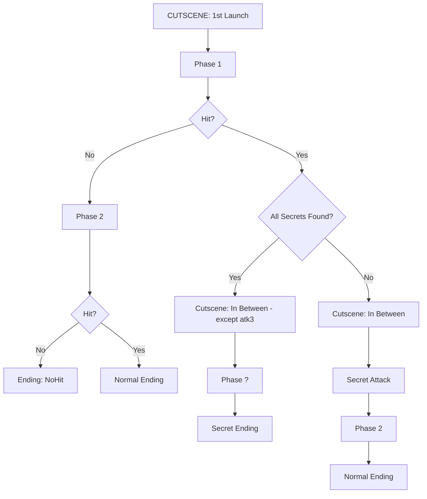

## Fight Structure

Use Electron react to create this program,

Include a debug menu if pressing 1 to select the atk ID to play

* **Turn-Based Bullet Hell**
  After each enemy attack, you get to fight once.

* **Stats**

    * **Enemy HP**: 6666
    * **Player HP**: 100

* **Damage**

    * **Phase 1**: Fixed 1 DMG
    * **Phase 2**: Random between 100–150 DMG, with a 1/666 chance of dealing **666** DMG

        * *Average hits to win*: `≈ 53`, based on this formula:

          ```
          6666 / ((1/666 * 666) + ((665/666) * (150+100)/2))
          ```

* **Save System**
  Saves to:

  ```
  /seen/what/shouldn't/be/seen.ini
  ```

---

## Fight Flow



---

## Endings

### I’m Blind *(Normal Ending)*

* Enemy fully heals
* Flashes: **3**, **15**, **25**
* Says **"INTERESTING"**, crashes game
* A text file is created and opened:

    * `Name:` `{DATE}{TIME}-blind.log`
    * `Contents:`

      ```
      "You saw what you were shown [1/3]"
      "Progress to the TRUTH [{Seen secret atk}/7]"
      ```

      Followed by a riddle about NoHit and ???

---

### Don't Touch *(No Hit Ending)*

* Enemy fully heals
* 15 seconds of silence
* Enemy “melts”
* Shows an image of a **tree**, then crashes
* A text file is created and opened:

    * `Name:` `{DATE}{TIME}-untouchable.log`
    * `Contents:`

      ```
      "Melted the unmeltable... though failed to defeat the defeatable?
      THERE IS SOMETHING UNDER YOUR FEET - DIG DEEPER [2/3]"
      "Progress to the TRUTH [{Seen secret atk}/7]"
      ```

      Followed by another riddle

---

### It Saw *(Secret Ending)*

* Phase \[?] lasts 6 turns
* Then enemy stares, says:

  ```
  "You know what you shouldn’t — and don’t know what you should...
  Go to {PATH}, and get the piece of me, the 2 in 1 and the 1 in 2"
  ```
* 3 seconds later → **Cutscene: Secrets Swallowed Whole**
* In `{PATH}`:
  File: `e_e.log`

  ```
  "... [3/3] ...
  THE KEY IS {KEYWORD[6]}
  YOU DEFEATED █████████
  54 68 65 20 47 72 65 61 74 20 4F 6E 65 27 73 20 4E 69 67 68 74 6D 61 72 65 :)"
  ```

---

## Cutscenes

### 🎞 CUTSCENE: First Launch

* Window title: `"WAIT"` → `"666"`
* Flashes timestamps: `3`, `15`, `25`
* After `666` seconds: fake error screen
* Spam error windows until they close themselves
* If forcibly closed during playback:
    * TXT: `"DONT FORCE ME EVER AGAIN"`
    * Deletes `.exe`
    * **BSODs the device**
* Audio: heartbeat, uncomfortable

---

### 🎞 CUTSCENE: In Between

* Always runs, even if seen before
* Runs ATK ID `[3]`
* Game freezes, desktop glitches
* Mouse/keyboard lock
* File `TR33DEATH.txt` is created:

    * Autotypes: `"I planted the tree, I broke the TREE LEAVING IT HOLLOW"`
* Changes desktop background to a **tree**
* 25s of flickering/shaking, then returns to normal

---

### 🎞 CUTSCENE: Secrets Swallowed Whole

* Opens Notepad and types:

> Roots that writhe, and roots that choke,
> A TREE once bloomed through splintered smoke.
> Three. Fifteen. Twenty-five — the gate,
> The vessel’s curse was sealed by fate.
>
> A cipher buried, bark decayed,
> Truth beneath the grain has stayed.
> TR33, TREE, §REDACTED§ bleeds —
> You've yet to climb beyond the seeds.
>
> The final seal, the final plea,
> Lies deep where none are meant to see.
> Speak the glyph. Unchain the reel.
> Or rot in what you **think** is real.

* Ends with violent screen flashing and **BSOD**

---

## 📁 File Structure

```plaintext
Vessel.exe
/media/                               # All files required by Vessel.exe
/seen/what/shouldnt/be/seen.ini       # Main save file
/seen/what/shouldnt/be/e_e.log        # Created only after Ending 3
/logs/fight/                          # Logs 0–42 (excl. 0 & 29 until triggered)
/logs/error/                          # Logs 1–666 (excl. 60, 99, 255, 333, 666 until triggered)
/mus/§.webm                           # CCTV-style desktop crash footage
/mus/_as_a_child_.mp3+1              # Misnamed MP3 with TTS poem
/mus/_log_the_apple_tree_.m4v       # 3hr blackscreen, QR frame at 15:25
/dont/touch/rootsim.exe              # Tree simulator with BSOD logic
/dont/touch/scare_tas.txt            # ASCII art + riddle
/dont/touch/leaf.txt                 # Created by rootsim.exe (not default)
/dont/touch/█.txt                    # Deep-encrypted entity lore
/dont/touch/shh.zip                  # Fake ZIP (actually an upside-down JPG of a rotten tree)
/lost/lost/lost/.../FINDME.txt       # Repeats 25x, leads to shh.zip
/can/you/decompile_me.exe            # Red herring
/runs/                                # All logs generated by winning Endings 1 & 2
```

---

### Info About Files

> More info in resources (all done except the ones generated btw)

**`seen.ini`**
→ Primary save system. Stores all flags, secrets, death states, and secret view tracking.

**`e_e.ini`**
→ Only created by Secret Ending (Ending 3). Flags total completion.

**`§.webm`**
→ CCTV-style footage of a hacked desktop. Ends with distorted voice:
**"3 live, 15 bloom, 25 DIE."**

**`_as_a_child_.mp3+1`**
→ Black video, child TTS reading a poem. Boosting brightness reveals: `31525`.

> "Plant the seed and watch it rot
> Count the cries that you forgot
> Three to bloom, Fifteen to sigh
> Twenty Five to say goodbye
> Lungs go *pop!* when the bugs crawl in
> Mama said *don’t breathe the sin!*
> Dig too deep and you’ll find a head
> Whispers giggle, “playtime’s dead!”"*

**`_log_the_apple_tree_.m4v`**
→ 3hr black screen. At 15:25, flashes QR code linking to a **Rickroll**.

**`rootsim.exe`**
→ Tree-based simulator with escalating outcomes:

1. If `leaf.txt` doesn’t exist → BSOD + create `leaf.txt`.
2. If `leaf.txt` exists → Draws `sapling.png` + BSOD.
3. If `sapling.png` exists → Draws `grow.png` (smile) + exits.
4. If `grow.png` exists → Deletes all outputs + BSOD.

**`leaf.txt`**
→ 404 lines, \~15,253 words — all tree-related, randomly ordered.

**`scare_tas.txt`**
→ ASCII tree with a riddle. The answer is: **TREE**.

**`█.txt`**
→ Requires **Fix encoding to UTF-8 (it will be in wrong encoding of UTF-16) → Base64 → Binary → Hex → Caesar Cipher x2**
→ Reveals:

> *"Entity is not the Eldritch, The Eldritch is the entity."*

**`shh.zip`**
→ Actually a **JPG** (not a zip). Image: *Upside-down rotten tree.*

**`FINDME.txt`**
→ Located in 25-nested `/lost/` folders. Poem hints at `shh.zip`:

> *"A face I wear serene and still
> But secrets hide beneath the chill
> Rename me once, and then begin
> The box is locked, the truth within"*

**`decompile_me.exe`**
→ Useless. Decompiled code taunts the user: *"Red herring."*

---

> Keyword 6) Unbirth

---

# `vessel.exe` Fight Game Plan

## Phase Breakdown

### **Phase 1 Attack Pool**

* **Main attacks** (97% chance):
  `any(B, 1, 2, 20, 23, 27)`
* **Fallback attack** (3% chance):
  `21 - Binding Rite`

---

### **Phase 2 Attack Pool**

* **Main attacks** (84% chance):
  `any(B, 4, 7, 8, 24, 25, 26)`
* **Fallback attack** (16% chance):
  `21 - Binding Rite`

---

### **Phase ? Attack Pool**

* **Special attacks only** (100% chance):
  `255, 666, 60, 0, 999999999, 0.5, 29`

---

## Shared Group B

* `B = any(5, 6, 18, 19, 22)`
  → Appears in Phase 1 & Phase 2
  → Weighted at **45%** chance within those pools

---

## Unused IDs

* **IDs 9–17 and 28** do not exist
  (Forgotten/miscounted — may be used for corruption effects or secrets)

---

## Rarity Calculation

> Based on: `1 / ((tier count × 8) - 2)`

### Defined Rarity Tiers

| Rarity         | IDs                    | Approx Rate |
|----------------|------------------------|-------------|
| **Common**     | 1, 20, 22, 24          | 1/6         |
| **Uncommon**   | 2, 5, 6, 7, 18, 19, 23 | 1/14        |
| **Rare**       | 4, 27                  | 1/22        |
| **Ultra-Rare** | 8, 25, 26              | 1/30        |

> `21` = fallback
> `3` = cutscene-only

---

# Attack Reference Table

| ID | Name (`~Old Name~`)               | Description                                              | Max At Once | Damage                            | Warn?                |
|----|-----------------------------------|----------------------------------------------------------|-------------|-----------------------------------|----------------------|
| 1  | Tendrils                          | Tendrils pulse & shoot 5x7 pellet waves                  | 2           | Tendril:5, Pellet:2               | ✅                    |
| 2  | Echowave `~Eldritch Wave~`        | Waves leave echo trails, bounce 7s                       | 2           | Wave:3, Trail:1C                  | ❌                    |
| 3  | Forgotten `~Meta Creepy Hands~`   | Slow hand creep, screen halved                           | 1           | 666 instakill (cutscene)          | ❌                    |
| 4  | Crawling Void `~Eldritch Scream~` | Tendrils, pellet rain + homing shots                     | 1           | Tendril:3, Pellet:2               | 🔶 Tendril only      |
| 5  | Phantom Soul `~Soul Clone~`       | Shadow clones teleport you, shoot                        | 3           | Pellets:2, Shadow:5               | 🔶 Only on teleport  |
| 6  | Wave                              | One-dodge-only pellet waves Tight pattern of 10–15 waves | 1           | Pellets:3                         | ❌                    |
| 7  | Mirror                            | Inverted controls + bouncing walls                       | 1           | Pellets:3                         | ❌                    |
| 8  | Supernova `~Collapsing Stars~`    | Star splits into smaller stars                           | 1           | L:24, M:6, S:2                    | ❌                    |
| 18 | Astral Barrage                    | Spiral vortex with suction center                        | 2           | Pellets:2, Portal:10              | ❌                    |
| 19 | Void Tempest                      | Portal blasts, explodes, creates chain                   | 3           | Pellets:2, Portal:10, Explosion:5 | ✅                    |
| 20 | Drift `~Spray~`                   | X-axis pellet waves (3 directions)                       | 1           | Pellets:2                         | ❌                    |
| 21 | Binding Rite `~Eldritch Chain~`   | Fixates, freezes you 5s if caught                        | 1           | 0                                 | 🔶 Hover phase       |
| 22 | Ouroboric Embrace `~Shrapnel~`    | Surrounds player, reflects out                           | 1           | Pellets:3                         | ❌                    |
| 23 | Bomb                              | Marked laser direction before blast                      | 3           | Laser:3, Bomb:5                   | 🔶 When bomb appears |
| 24 | Hollow Beam `~Blaster~`           | Laser beam arcs down slowly                              | 2           | Laser:5                           | ✅                    |
| 25 | Tri-Spiral `~Swirl~`              | Pellets spiral in, curve, high speed                     | 1           | Pellets:2                         | ❌                    |
| 26 | Hell Circle                       | Oscillating spiral burst for 7s (8 lines)                | 1           | Pellets:2                         | 🔶 On start          |
| 27 | O2                                | Bouncing chaos, one homing shot                          | 1           | Pellets:2                         | ❌                    |

---

# Special Attacks (Phase ? Only)

All deal **1C** (continuous, no i-frames)
Only one can happen at a time.

| ID          | Name (`~Old Name~`)          | Reason / Concept   | Description                          | TTS Audio                       | Chance     |
|-------------|------------------------------|--------------------|--------------------------------------|---------------------------------|------------|
| `255`       | 0x4950434F5245 `~localhost~` | Max IP octet       | Numbers fall to spell your IP        | **IS THIS FAMILIAR**            | 61 / 11100 |
| `666`       | Moonlight `~Luna~`           | Obvious...         | Giant moon sweeps left, undodgeable  | **Must Open Orifices Now**      | 1 / 666    |
| `60`        | 0x4e4f54494d45 `~Times Up~`  | 60 sec = time      | Clock hands rotate, player pulled in | **Tick Tock...**                | 1 / 24     |
| `0`         | 0x44454c455249554d `~Dream~` | Mouth-shaped zero  | Statue floods screen, restores HP    | **HE CONNECTED**                | 1 / 666    |
| `999999999` | カオス `~Ch@0$~`                | 9 = chaos          | Pure bombardment from below          | `Garbled Noise`                 | 1 / 666    |
| `0.5`       | Split                        | 0.5 = you’re split | WASD controls left, Arrows right     | **Split in 2...**               | 1 / 2      |
| `29`        | ?¿                           | 9+20 = 29          | 2 bouncing question marks            | **I have so many questions...** | 9 / 20     |

